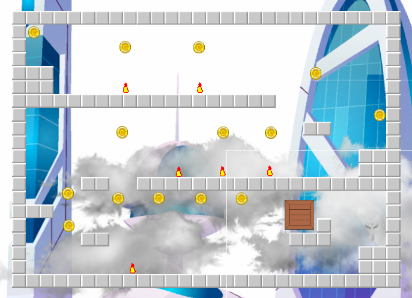
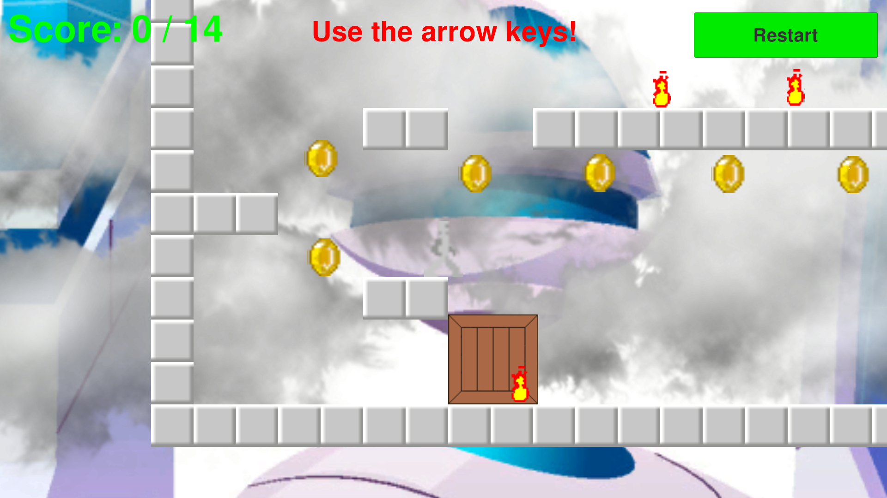

# Silver Robot

## Game Design Document

**DOWNLOAD: [GameDesignDocument.pdf](./GameDesignDocument.pdf)**

**YouTube Video: [https://youtu.be/AbwUgsrMmzA](https://youtu.be/AbwUgsrMmzA)**

**GitHub Repository: [https://github.com/jckuri/mini_robot](https://github.com/jckuri/mini_robot)**

**Builts for Linux, Windows, and Mac: [https://github.com/jckuri/mini_robot/tree/main/SilverRobot/BUILD](./SilverRobot/BUILD/)**

**IMPORTANT NOTE: I added the full directories `SilverRobot/Library/` and `SilverRobot/Assets/Shared` to the file `.gitignore` in order to significantly reduce the size of this GitHub repository.**

A GDD (game design document) is a highly descriptive, living document of the design of a video game. It helps to define the game details and features you intend for your game.

Completing a draft of this document upfront and then revisiting it to add and update it during your game development process is recommended. The final version of this document does not necessarily need to represent the final version of your game.

While not all of this information will directly impact your finished 2D Platformer Game build, it will help you plan the project, source the assets, and develop the game.

Please complete all of the numbered bullet points below. 

Table Of Contents

[Game Design Sketch](#game-design-sketch) 
[Game Concept](#game-concept) 
[Game Mechanics](#game-mechanics) 
[Optional: Standout Suggestions](#optional-standout-suggestions) 

### Game Design Sketch

This section includes at least one game design sketch that you create. It communicates your ideas for the game, such as its appearance, structure, and behavior. The sketch(es) need to show 3 tile map layers and 2 or more user interface elements. Optionally, the sketch(es) may include additional elements as you like. 

**1. Add your sketch(es) here**

Motion parallax has 3 layers:

**Midground layer**

The midground layer contains all the blocks, coins, the crate, and the initial position of silver robot. It has the structure of the video game.

**Cloud layer**

The cloud layer has fully transparent pixels, partially transparent pixels, and fully opaque pixels representing the clouds, which are between the midground layer and the background layer.

**Background layer**

The background is simple and futuristic like silver robot.

The game has blocks, fires, coins, a crate, and the player Silver Robot.

The UI has 3 elements:

- The Restart button; 
- a text with information about the coins collected and the total amount of coins to be collected; 
- and a text with status information about game instructions, winning, and game over.

**UnityProjectWindow.png**

### Game Concept

This section describes the game’s story, environment, characters, etc.

**2. What is the storyline or narrative of your game?**

Silver Robot is a 2D Platformer Game whose objective is to collect 14 coins while avoiding the
fires. This video game is simple and straightforward. Even novice players can win the video
game in less than 1 minute.

**3. What are the main characters and objects in your game, and what roles do they play in the story and gameplay?**

The main character is Silver Robot who has to avoid the fires and collect all the 14 coins in
order to win the video game. Correctly using the crate in the game is mandatory. Otherwise you
won’t be able to collect some coins. The video game has many blocks which create the
structure of the virtual world.

Here are the sources for the audio in the video game. As you can see they are free to use.

Depth Charge - Critical Battery Alarm.wav 
https://freesound.org/people/liquidhot/sounds/98365/  
(This is the game over sound.)

Robot Love Scream.flac 
https://freesound.org/people/qubodup/sounds/197256/  
(This is the winning sound.)

Collecting Coins 
https://freesound.org/people/Philip_Berger/sounds/693840/  
(This is the sound of collecting coins.)

Robot Jump 2.wav 
https://freesound.org/people/Modus7/sounds/238282/  
(This is the sound for jumps.)

Here are the sources for the visual art in the video game. As you can see they are free to use.

Future city futuristic buildings with glass facade Free Vector 
https://www.vecteezy.com/vector-art/15485710-future-city-futuristic-buildings-with-glass-facade  
(This is the futuristic background.)

Cloud PNG image with transparent background | cloud_PNG112204.png 
https://pngimg.com/image/112204  
(These are the clouds.)

Rotating Coin 
https://opengameart.org/content/rotating-coin  
(These are the sprites for the coins.)

I drew pixel by pixel the sprites for the silver robot, the fires, the blocks, and the crate. And that’s why they are very simplistic and imperfect. It’s my own honest work.

### Game Mechanics

This section includes the core gameplay mechanics, input controls, and how the player interacts with the game.

**4. What is the complete list of input actions that the player can perform, and how do these actions impact the game world?**

Silver Robot can move with the left arrow and the right arrow. Silver Robot can jump with the up
arrow. Silver Robot can push the crate by walking toward it.

**5. What is the typical gameplay loop (repeated actions) for the player?**

Silver Robot has to avoid the fires and collect all the 14 coins in order to win the video game. If
the robot touches one of the fires, the game is over. Correctly using the crate in the game is
mandatory. Otherwise you won’t be able to collect some coins.

### Optional: Standout Suggestions

This section contains "Standout Suggestions" for your game. These are game mechanics or other game features that aren't necessary for your game, but that would be great additions if you have the spare time. Adding such extras can really make your game shine. So, if you complete your game ahead of schedule, you might think about adding one or more of these ideas. For example, the following are standout suggestions that are relevant for a 2D Platformer type of game. 

**6. Playable Character Double Jump**

Not implemented.

**7. Breakable Crate Object**

Not implemented.

**8. Enemy Character AI**

Not implemented.
